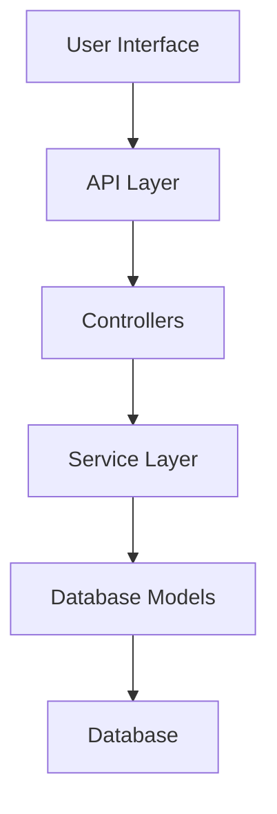
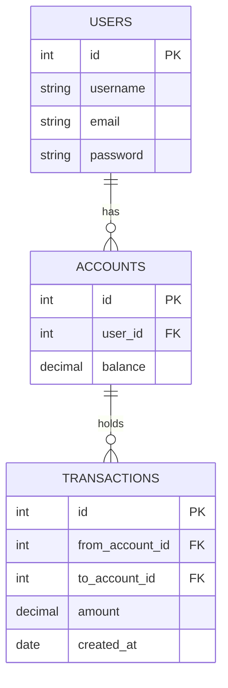

# BankApp

BankApp is a full-stack banking application that enables users to manage accounts, perform transactions, and view balances through a secure and user-friendly interface. This documentation provides a comprehensive overview of the repository, covering setup, architecture, APIs, and best practices.

---

## Table of Contents

- [Overview](#overview)
- [Features](#features)
- [Architecture](#architecture)
- [Installation](#installation)
- [Configuration](#configuration)
- [Running the Application](#running-the-application)
- [Database Schema](#database-schema)
- [API Documentation](#api-documentation)
- [Testing](#testing)
- [Contributing](#contributing)
- [Best Practices](#best-practices)
- [Troubleshooting](#troubleshooting)
- [License](#license)
- [Contact](#contact)

---

## Overview

BankApp is designed for educational and demonstration purposes. It provides core functionalities of a banking system, such as account management, fund transfers, transaction history, and authentication.

---

## Features

- User registration and authentication
- Secure login with session management
- Account creation and management
- Fund transfers between accounts
- Transaction history and balance tracking
- RESTful API endpoints
- Error handling and input validation

---

## Architecture

BankApp follows a layered architecture with clear separation between models, controllers, services, and routes. It uses an MVC (Model-View-Controller) pattern to promote maintainability and scalability.



---

## Installation

Follow these steps to install BankApp locally:

1. Clone the repository:
   ```bash
   git clone https://github.com/bhaskarsingamshetty/bankapp.git
   cd bankapp
   ```
2. Install dependencies:
   ```bash
   npm install
   ```
3. Set up environment variables as described in the [Configuration](#configuration) section.

---

## Configuration

BankApp requires environment variables for database connection, authentication, and server configuration. Create a `.env` file in the root directory with the following:

```
PORT=3000
DB_HOST=localhost
DB_PORT=5432
DB_USER=your_db_user
DB_PASSWORD=your_db_password
DB_NAME=bankapp
JWT_SECRET=your_jwt_secret
```

---

## Running the Application

Start the application with:

```bash
npm start
```

For development with hot-reloads:

```bash
npm run dev
```

---

## Database Schema

The database consists of users, accounts, and transactions tables. Relationships are managed via foreign keys.



---

## API Documentation

BankApp exposes a set of RESTful endpoints for core banking operations. Each endpoint requires proper authentication.

### Register New User (POST /api/register)

#### Endpoint

```api
{
    "title": "User Registration",
    "description": "Register a new user with username, email, and password.",
    "method": "POST",
    "baseUrl": "https://api.bankapp.com",
    "endpoint": "/api/register",
    "headers": [],
    "queryParams": [],
    "pathParams": [],
    "bodyType": "json",
    "requestBody": "{\n  \"username\": \"jane_doe\",\n  \"email\": \"jane@example.com\",\n  \"password\": \"securepass123\"\n}",
    "responses": {
        "201": {
            "description": "User created successfully",
            "body": "{\n  \"message\": \"User registered successfully.\"\n}"
        },
        "400": {
            "description": "Validation error",
            "body": "{\n  \"error\": { \"message\": \"Missing required fields.\" }\n}"
        }
    }
}
```

### User Login (POST /api/login)

#### Endpoint

```api
{
    "title": "User Login",
    "description": "Authenticate user and issue JWT token.",
    "method": "POST",
    "baseUrl": "localhost:8080",
    "endpoint": "/api/login",
    "headers": [],
    "queryParams": [],
    "pathParams": [],
    "bodyType": "json",
    "requestBody": "{\n  \"email\": \"jane@example.com\",\n  \"password\": \"securepass123\"\n}",
    "responses": {
        "200": {
            "description": "Login successful, returns JWT token",
            "body": "{\n  \"token\": \"<jwt_token>\"\n}"
        },
        "401": {
            "description": "Authentication failed",
            "body": "{\n  \"error\": { \"message\": \"Invalid credentials.\" }\n}"
        }
    }
}
```

### Get Account Balance (GET /api/accounts/:id/balance)

#### Endpoint

```api
{
    "title": "Get Account Balance",
    "description": "Retrieve current balance for a specified account.",
    "method": "GET",
    "baseUrl": "https://api.bankapp.com",
    "endpoint": "/api/accounts/:id/balance",
    "headers": [
        {
            "key": "Authorization",
            "value": "Bearer <token>",
            "required": true
        }
    ],
    "queryParams": [],
    "pathParams": [
        {
            "key": "id",
            "value": "Account ID",
            "required": true
        }
    ],
    "bodyType": "none",
    "responses": {
        "200": {
            "description": "Balance retrieved",
            "body": "{\n  \"account_id\": 1,\n  \"balance\": 1000.00\n}"
        },
        "404": {
            "description": "Account not found",
            "body": "{\n  \"error\": { \"message\": \"Account does not exist.\" }\n}"
        }
    }
}
```

### Transfer Funds (POST /api/accounts/transfer)

#### Endpoint

```api
{
    "title": "Transfer Funds",
    "description": "Transfer funds between accounts.",
    "method": "POST",
    "baseUrl": "https://api.bankapp.com",
    "endpoint": "/api/accounts/transfer",
    "headers": [
        {
            "key": "Authorization",
            "value": "Bearer <token>",
            "required": true
        }
    ],
    "queryParams": [],
    "pathParams": [],
    "bodyType": "json",
    "requestBody": "{\n  \"from_account_id\": 1,\n  \"to_account_id\": 2,\n  \"amount\": 50.00\n}",
    "responses": {
        "200": {
            "description": "Transfer successful",
            "body": "{\n  \"message\": \"Transfer completed successfully.\"\n}"
        },
        "400": {
            "description": "Insufficient funds",
            "body": "{\n  \"error\": { \"message\": \"Insufficient balance.\" }\n}"
        }
    }
}
```

### View Transaction History (GET /api/accounts/:id/transactions)

#### Endpoint

```api
{
    "title": "View Transaction History",
    "description": "Retrieve transaction history for a specific account.",
    "method": "GET",
    "baseUrl": "https://api.bankapp.com",
    "endpoint": "/api/accounts/:id/transactions",
    "headers": [
        {
            "key": "Authorization",
            "value": "Bearer <token>",
            "required": true
        }
    ],
    "queryParams": [],
    "pathParams": [
        {
            "key": "id",
            "value": "Account ID",
            "required": true
        }
    ],
    "bodyType": "none",
    "responses": {
        "200": {
            "description": "Transaction history retrieved",
            "body": "{\n  \"transactions\": [\n    {\n      \"id\": 1,\n      \"amount\": 100.00,\n      \"type\": \"deposit\",\n      \"date\": \"2024-05-10\"\n    }\n  ]\n}"
        },
        "404": {
            "description": "Account not found",
            "body": "{\n  \"error\": { \"message\": \"Account does not exist.\" }\n}"
        }
    }
}
```

---

## Testing

BankApp includes unit and integration tests for all major components. Run tests with:

```bash
npm test
```

Test coverage includes models, controllers, and API endpoints.

---

## Contributing

We welcome contributions! Please follow these steps:

- Fork the repository
- Create a feature branch
- Commit your changes with clear messages
- Open a pull request describing your changes

Make sure to add tests and update documentation as needed.

---

## Best Practices

- Validate all user input
- Use HTTPS in production
- Store sensitive data securely (never commit secrets)
- Follow consistent code style and naming conventions
- Write tests for new features and bug fixes

---

## Troubleshooting

- Ensure database service is running and credentials are correct.
- Check `.env` configuration for correctness.
- Review application logs for error details.
- Restart the server after configuration changes.

---

## License

This project is licensed under the MIT License.

---

## Contact

For questions, open an issue or contact the maintainer via GitHub Issues.

---

```card
{
    "title": "Security Reminder",
    "content": "Never share your JWT tokens or sensitive credentials. Always use environment variables for secrets."
}
```
